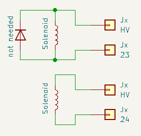

# PPUC Hardware

When we talk about hardware, we actually often mean the PCBs (printed circuit boards) of the PPUC project. Of course there is more hardware in a pinball machine that is somehow all connected to each other (like solenoids, lamps, power supply, ...).

EM (electro mechanical) machines are not covered here (although you could pimp them up with electronics).

Virtual pinball machines can profit from PPUC. You can make them much more interesting with this hardware but this article concentrates on building real pinball machines.

After reading this article you should have an understanding of

* what hardware is needed for a pinball machine
* what specific hardware of the PPUC project is available
* how PPUC and other hardware is connected and wired
* which wires are needed
* how the PCBs are connected to each other
* how much power is needed
* what kind of power supply can be used
* how many PCBs are needed

## Hardware Used for a Pinball Machine
To build a pinball machine you usually need some stuff. Here are the most important things.

You find tons of information here: [PinWiki](https://www.pinwiki.com)

### Electronics
These are the PCBs that drive the solenoids, reads the switches, runs the software and lights the bulbs. They also take care of the correct power supply and voltages for the parts.

### Solenoids
These are used for mechanical action. They are made of a coil of wire and a metal plunger. When electricity flows through the coil, it generates a magnetic field that pulls or pushes the plunger and thereby makes a linear motion.

### Switches
Switches recognizes where the balls are at the moment or what state an actor is in. They can be directly wired to an input or (to save wires and ports) they can be wired as a matrix (e.g. 8x8 -> 64 switches done with 16 ports). Matrix concept is more complex and need diodes at the switches. Switches can be mechanical or optical.

### Lamps
These are used for bling bling. They light the inserts (bottom of playfield), the general illumination (GI) on top of the playfield and they are used for special effects like flashers. The flashers are typically lit only for less than a second. They have higher power and voltage than bulbs for GI and inserts. Nowadays LEDs are used for lamps and flashers but in older machines incandescent light bulb were used. Like the switches the lamps can be controlled directly (one by one) or in a lamp matrix arrangement.

 

### Display
Used to display the score, rules, video modes and animations.

* Nowadays TFT (thin film transistor) technology is used (well known from computer monitors).
* In the 90s DMD (dot matrix display) was the main technology. That is a monochrome (orange on black) display with a typical resolution of 128x32 pixels.
* Earlier machines uses 7 (or more) segment displays

### Audio
To get some sound to your ears several speakers are used with an amplifier that is usually part of the electronics PCBs.

## Specific Hardware of the PPUC Project
We designed some specific PCBs for PPUC project although they might be useful in other applications as well. Here is an overview what is available and what they can do. Fore more information there is a detailed description available for each PCB.

* [IO_16_8_1](./io_16_8_1/): most basic PCB, always needed. Uses for reading switches, driving solenoids and control one LED strip.
* [IO_16x8_matrix](./io_16x8_matrix/): convenient if a switch matrix is used. Especially if the original cable harness shall be used. Can control a 16x8 switch matrix. Or use for 16 inputs and 8 outputs. Also can control one LED strip.
* [Out_8x10](./out_8x10/): convenient if a lamp matrix is used. Especially if the original cable harness shall be used. Can control a 8x10 lamp matrix [^f1] (only LEDs, no incandescent light bulbs!). Or use for 8 high side outputs and 10 low side outputs. Also can control one LED strip.
* [Opto_16](./opto_16/): used to directly attach optical switches like opto couplers or LED transmitter/receiver pairs.

The following table shows how many functions can be done with wich PCB. With that table you can estimate how many PCBs you need for your specific project. Just count the needed solenoids, flashers, lamps and switches. Take into account if you want to use controlled LED strips vs LED matrix vs direct LED drivers (mostly a mixture is used). Also think about direct switches vs switch matrix. And take into account if you have original opto boards from your pin or not.

| Function/Name | IO_16_8_1 | IO_16x8_matrix | Out_8x10 | Opto_16 |
| :-----------: | :-------: | :------------: | :------: | :-----: |
| direct switch |    16     |       16       |    -     |    -    |
| switch matrix | 8x8 [^1]  |      16x8      |    -     |    -    |
|   solenoid    |     8     |       -        |    -     |    -    |
|  direct LED   | 4+8 [^2]  |     8 [^4]     | 10 [^4]  |    -    |
|  LED matrix   |     -     |       -        |   8x10   |    -    |
|  LED flasher  | 4+8 [^2]  |       -        | 10 [^4]  |    -    |
|   LED strip   |     1     |       1        |    1     |    1    |
|  opto switch  | (16) [^3] |   (16) [^3]    |    -     |   16    |
| UART/SPI/I2C  |     1     |       -        |    -     |    -    |
|   ADC [^5]    |     -     |       -        |    -     |    2    |
|   PWM [^6]    |     -     |       -        |    -     |    6    |

[^1]: with modifications on input resistor. On cost of inputs. Mixture mode is also possible (e.g. 8 direct switches and a 4x4 matrix)

[^2]: 4 x mid power output on cost of 4 inputs plus 8 high power outputs

[^3]: only the receiver side can be connected if it is an transistor type and if it switches to GND (common emitter). On cost of inputs.

[^4]: on cost of matrix drivers

[^5]: analog to digital converter

[^6]: pulse with modulation (e.g. for analog output signals)

## How to Connect PPUC-PCBs With Pinball Parts

### Direct Switch
Wiring is straight forward. Switches must close to ground (GND, G). The GND can be connected at the switches or at the terminal clamp. All terminals named "G" are good for the common switch connection.

Recommendation for wire cross section is 0.25 mm². The wires can be as thin as it is practical from a mechanical point of view. They must carry only a few milliamperes of current. They should not be thicker than 0.5 mm² as they should easily fit into a terminal clamp (better if two wires fit into one clamp).

### Switch Matrix
To use the switches in a matrix all switches must have a diode in series. The switches are not connected to ground but to the column and row terminals (if the terminals act as row or column has to be declared in the configuration file).

Recommendation for wire cross section is 0.25 mm². The wires can be as thin as it is practical from a mechanical point of view. They must carry only a few milliamperes of current. They should not be thicker than 0.5 mm² as they should easily fit into a terminal clamp (better if two wires fit into one clamp).

### Solenoid
Wiring solenoids is straight forward. Two terminals for each solenoid. No need for a diode. If there is a diode already at the coil you can leave it there but make sure the HV terminal is at the diodes ring. Better double check - otherwise smoke will rise.

Be aware that the power output switches are open drain. Therefore you also need a power supply for the solenoids. This is distributed by the board to the HV-terminals. Just connect the power (e.g. 48 V) to the terminals called HV_IN (+) and G_IN (-).

Use a paired cable (like speaker cable). Recommendation for wire cross section is 2 x 0.5 mm². Shouldn't be thicker than 1.5 mm² as the clamps can't take thicker cables.

### Direct LED
To connect a LED (including rectifier, current limiting resistor and capacitor) you can use a mid power output that closes the circuit to ground (same is true for drivers of the matrix boards wich could also be used). Therefore the LED must be supplied with a voltage of typically 6.3 V but 5 V will do as well with slightly reduced brightness. You could also use a high power output. In that case connect it like a solenoid and don't forget to adjust the PWM in the config file for correct voltage.

Recommendation for wire cross section is 0.25 mm². You can roughly estimate a maximum current of 20 mA per LED.

### LED Matrix
A LED matrix can only be controlled by the Out_8x10 board. Like in the switch matrix every LED must have a diode in series. The LEDs are connected to the high-side and low-side switches of the Out_8x10 board. Be aware that you need a high supply voltage (20 V) for the matrix as the LEDs are only on for a short time.

Recommendation for wire cross section is 0.25 mm². You can roughly estimate a maximum current of 20 mA per LED.

### LED Flasher
Flashers are connected like direct LEDs. Use a mid power output or connect them like solenoids (with adjusted PWM value in the config file).

### General Illumination (GI)
The GI (consisting of several LEDs in parallel) are usually connected like solenoids (with adjusted PWM value in the config file). But you can also use a mid power output (likewise the direct LEDs).

### Controlled LED Strip
Controlled LED strips (e.g. with WS2812B LEDs) are daisy chained LEDs that can be individually controlled. To archive that each LED has a chip inside. Power supply is 5 V and the single data line is connected to a special terminal (#25).

How much current for LED strips? No idea as there is no value in the data sheet. Just found this as a reference (36 mA per RGB-LED for WS2812B): [SunTech Lite](https://suntechlite.com/power-consumption-of-ws2811-ws2812b-ws2813-ws2815-sk6812/)

Recommendation for wire cross section is 0.5 mm² (for power lines).

### Optical Switches
If you have the original opto boards form you pinball, you can use them and connect them like direct switches or within a switch matrix.

If you don't have the original board you can use the Opto_16 board. This has divers and receivers for 16 optical switches. They can be configured (with jumpers) in two groups: for LED receivers and for transistor receivers.

Recommendation for wire cross section is 0.25 mm².

### Display
These kinds of display are commonly used in pinball machines:

* TFT: thin film transistor technology, used in newer machines, well known from computer monitors. If you want to use a TFT in your own machine you can connect this directly to your main pinball controller (like a raspberry pi) per HDMI or similar.
* DMD: dot matrix display, used in the 90th, typically a monochrome (orange) plasma with a typical resolution of 128x32 pixel. In your own PPUC pinball machine you want to replace this by a RGB-LED-matrix display. See section [ZeDMD](../zedmd/index.md).
* Segment: 7 or more plasma segments that can display alphanumerical content, used in earlier pins. In your own PPUC pinball machine you want to replace these by a RGB-LED-matrix display. See section [ZeDMD](../zedmd/index.md).

### Sound
To get some audio to your ears one or more speakers and an amplifier is necessary. The audio source is generated by the main pinball controller (like a raspberry pi) and can be connected by Bluetooth or USB or audio jack. There is no special PPUC equipment available (as it isn't needed).

## How to Connect PPUC-PCBs With Each Other
All PPUC board needs a power supply (5 V) and a connection to the communication bus (RS485).

The 5 V power supply can be wired in a star topology or from one board to the next. Connect the 5 V power supply to the terminals called 5_IN (+) and G (-). The board itself doesn't need much power (about 250 mW). Therefore the wires can be thin. Anyways it's recommended to use 0.5 mm² cross section as you often want to power more from the 5 V (like LED strips).

The bus connection shall be made in a line topology (one board to the next) using terminals called "A" and "B". Typically starting at the main pinball controller (like a raspberry pi) and end on one of the PPUC boards. Be aware that the communication bus works best when it is terminated on both ends and has a bias network anywhere along the bus. This can conveniently be done by jumpers on the PPUC boards. 

* IO_16_8_1: set JP2 for termination. Set JP1 and JP3 for biasing.
* IO_16x8_matrix, Opto_16, Out_8x10: set JP1 for termination (no biasing possible)

Use only exactly one bias network on the bus (no matter where). Terminate the bus at the geometrical start and at the geometrical end (not in between) and never add more than these two terminations.

If you use a shielded cable you can connect the shield to the terminal called SHD. Shielding is not mandatory but twisted pair cable is recommended.

## Thoughts on Power Supply
It can kill you! Be aware that you work with deadly voltages, especially on the primary side. If you don't know exactly what you are doing, leave it and ask for help on this part. I repeat: it can kill you, no joke!

Having said that let's come to the technical part. You have to know how much power you need on the 5 V side and on the 48 V side and if it should be 48 V or less. Let's brake this down:

### 5 V Supply:

* PPUC boards -> 250 mW per board
* LED strip -> 180 mW per RGB-LED
* single LED or LED matrix or GI -> 100 mW per LED
* ZeDMD -> 20 W maximum (all pixels white). In pinball use with lots of colors and therefore less brightness it's probably the half.
* Raspberry Pi 4: 12 W

For example: 4 boards (1 W) + 50 GI LEDs (5 W) + 70 LED-strip (13 W) + ZeDMD (20 W) + Raspberry Pi (12 W) -> adds up to 51 W. So you need a 5 V, 10 A power supply. Of course you can split the 5 V supply. E.g. power the Pi or the DMD with a separate power supply.

### 48 V Supply:
48 V is a good standard voltage for modern solenoids. But you could as well use 24 V (for older solenoids). It depends on what you already have. But be aware that with the PWM you can lower the 48 V to any voltage you want. For example with 48 V and a PWM of 50 % the solenoids akt like they would be connected to 24 V.

It's hard to estimate the needed power on the 48 V side. That depends much on how many solenoids are used and how many are active at the same time. Are magnets in the machine? To get a feeling: a WPC flipper finger needs 500 W when flipping (takes about 25 milliseconds) and 30 W while holding.

Recommendation is 500 W for WPC and modern machines (500 W are used in Stern Spike 2 systems). For a system 11 probably 350 W is sufficient. 

### 20 V for LED Matrix
If you want to use a LED matrix you must have a power supply of about 20 V. You can derive that from your 48 V with a DC/DC converter or use a separate power supply for the matrix. Needed power is 100 mW per LED.

### Power for Audio
If your amplifier doesn't have a power supply on board, you need that on top. It's recommended to use a separate power supply for sound (less distortion and noise). Needed power and voltage depends on your amplifier (look in it's data sheet). Typical values are 24 V, 100 W.

## Putting it All Together

